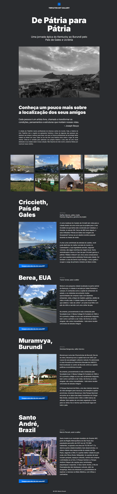

# 🌍 Tripleten Homeland


> 🧪 Projeto desenvolvido como parte do meu aprendizado em desenvolvimento web. Uma página simples, responsiva, com foco em estruturação visual e organização de conteúdo.

---

## 🔗 Acesse o projeto online

👉 [**Clique aqui para ver o site publicado**](https://perozin.github.io/web_project_homeland/)

---

## 🧰 Tecnologias utilizadas

- 🎨 **HTML5**
- 💠 **CSS3**
- 🔧 **Flexbox & Grid**
- 📱 **Media Queries**
- 🧭 **Git + GitHub**
- 🌐 **GitHub Pages** para hospedagem

---

## 🖼️ Captura de tela



---

## 📁 Estrutura do projeto

```web_project_homeland/
├── .vscode/
│ ├── extensions.json
│ └── settings.json
│
├── blocks/
│ ├── card.css
│ ├── footer.css
│ ├── header.css
│ ├── intro.css
│ ├── page.css
│ ├── photo.css
│ ├── places.css
│ └── root.css
│
├── images/
│ └── [imagens do projeto]
│
├── pages/
│ └── index.css
│
├── vendor/
│ ├── fonts/
│ │ └── [arquivos de fontes]
│ ├── fonts.css
│ └── normalize.css
│
├── .editorconfig
├── .gitignore
├── .prettierignore
├── favicon.ico
├── index.html
└── README.md```

---

## 📚 Aprendizados com o projeto

✅ Estruturação de página com HTML5  
✅ Organização visual com CSS3  
✅ Centralização com Flexbox  
✅ Layout em grade com Grid  
✅ Design responsivo com `@media`  
✅ Publicação gratuita com GitHub Pages  
✅ Controle de versões com Git

---

## 🚧 Melhorias futuras (to-do)

- [ ] Adicionar HTML semântico (`<header>`, `<section>`, `<footer>`)
- [ ] Criar mais breakpoints para responsividade (375px, 768px, etc.)
- [ ] Inserir animações leves com CSS
- [ ] Explorar JavaScript para interações básicas

---

## 🙋‍♂️ Autor

Desenvolvido por **Marcio Persuin** 🇧🇷  
🔗 [Meu GitHub](https://github.com/Perozin)

---
